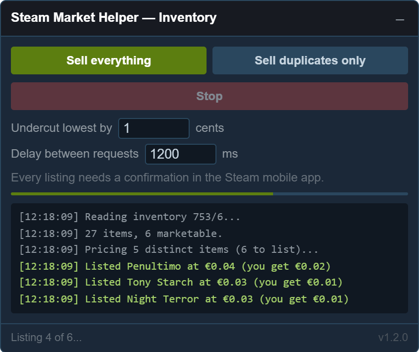
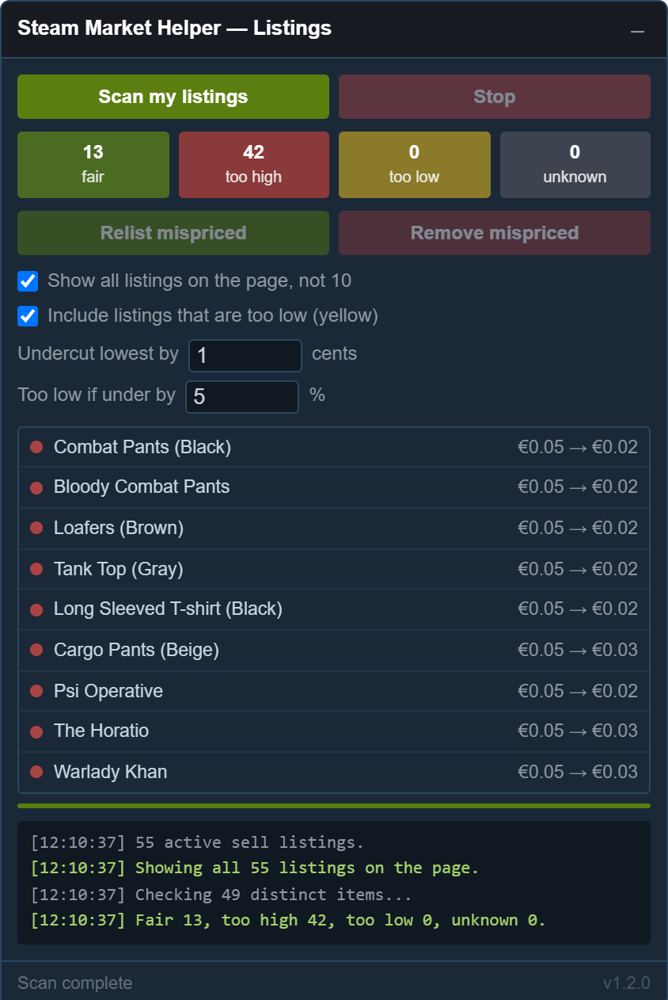

# Steam Market Helper

A userscript that bulk-sells your Steam inventory and keeps your market listings
priced sensibly. A deliberately smaller replacement for
[Steam Economy Enhancer](https://github.com/Nuklon/Steam-Economy-Enhancer),
which stopped working when Valve shipped the Market Beta UI.

Five things, and nothing else:

- **Sell everything** in the current inventory, priced one cent under the
  cheapest competing listing.
- **Sell duplicates only** — keeps one of each, lists the rest.
- **Colour-code your active listings**: green fair, red too high, yellow too low.
- **Remove** or **relist** the mispriced ones, as two separate buttons.
- **Show all your listings on one page** instead of ten at a time.

<table>
<tr>
<td width="50%" valign="top" align="center">
<br>
<sub><b>Inventory page</b> — selling</sub>
</td>
<td width="50%" valign="top" align="center">
<br>
<sub><b>Market page</b> — colour-coded listings</sub>
</td>
</tr>
</table>

---

## Install

1. Install **Violentmonkey**
   ([Chrome](https://chromewebstore.google.com/detail/violentmonkey/jinjaccalgkegednnccohejagnlnfdag)
   · [Edge](https://microsoftedge.microsoft.com/addons/detail/violentmonkey/eeagobfjdenkkddmbclomhiblgggliao)
   · [Firefox](https://addons.mozilla.org/firefox/addon/violentmonkey/))
   or **Tampermonkey**
   ([Chrome](https://chromewebstore.google.com/detail/tampermonkey/dhdgffkkebhmkfjojejmpbldmpobfkfo)
   · [Edge](https://microsoftedge.microsoft.com/addons/detail/tampermonkey/iikmkjmpaadaobahmlepeloendndfphd)
   · [Firefox](https://addons.mozilla.org/firefox/addon/tampermonkey/)).
2. **Chrome and Edge only:** right-click the extension icon → **Manage
   extension** → toggle **Allow user scripts** on. Miss this and nothing runs,
   with no error to tell you why. Firefox does not need it.
3. Open [the raw script](https://raw.githubusercontent.com/federicogiorgi/SteamMarketHelper/main/steam-market-helper.user.js)
   and confirm the install.

A panel appears bottom-right on your inventory page and on
[`steamcommunity.com/market`](https://steamcommunity.com/market/). Drag it by
its title bar; click the `–` to collapse.

**Uninstall:** extension icon → the script's remove/trash icon → confirm. Nothing
is left behind on Steam.

**→ [Full installation guide](INSTALL.md)** if step 2 does not go as described,
or the panel does not appear.

---

## Using it

The script runs on two pages, and nowhere else:

- **Your inventory** — `https://steamcommunity.com/id/<your vanity name>/inventory`,
  or `https://steamcommunity.com/profiles/<your 17-digit steamid>/inventory`
- **The market** — [`https://steamcommunity.com/market/`](https://steamcommunity.com/market/)

Open either one and the panel appears bottom-right. If it does not, the install
did not take — see [the installation guide](INSTALL.md).

### Selling

Open your inventory, pick the game whose items you want to sell, and press
**Sell everything** or **Sell duplicates only**.

The script reads the inventory, groups by item so twelve copies of one card cost
one price lookup rather than twelve, and lists each at one cent under the
cheapest competing listing.

**Every listing then needs a confirmation in the Steam mobile app.** This is
Steam's rule for anyone with 2FA and cannot be worked around. The app will let
you confirm them in bulk, which makes a hundred listings tolerable.

### Listings

On [`steamcommunity.com/market`](https://steamcommunity.com/market/), press
**Scan my listings**. Each listing gets a colour:

| | meaning | what it costs you |
|---|---|---|
| 🟢 green | cheapest listing, by a sensible margin | nothing — this is where you want to be |
| 🔴 red | somebody is cheaper than you | it will not sell until they do |
| 🟡 yellow | cheapest, but by more than you needed | you are leaving money on the table |
| ⚪ grey | could not be judged | see *unknown listings* below |

Then either:

- **Remove mispriced** — cancels them. Items go back to your inventory and stay
  there.
- **Relist mispriced** — cancels them, waits for the items to come back, and
  lists them again at the current correct price.

Both act immediately without a confirmation step. The yellow tickbox controls
whether "mispriced" includes the too-cheap ones; red is always included.

---

## How it decides

Everything comes from `/market/orderbook`, which returns full buy and sell depth
as integer cents.

**Your own listings are subtracted from the book first.** This is the part that
is easy to get wrong and the reason a naive version of this tool is worse than
useless: if you hold the cheapest listing, the lowest price in the book *is your
own price*, and comparing against it would report you as perfectly placed no
matter how far you had undercut yourself.

With your own quantity removed, the lowest remaining price is the real
competition, and then:

- above it → **red**
- below it by at least 2 cents *and* 5% → **yellow**
- *strictly* below the highest standing buy order → **yellow** (somebody is
  openly offering more than you are asking)
- otherwise → **green**

Both yellow thresholds must be met, so a three-cent card does not get flagged
forever for being one cent light.

**Green means correctly priced, not "will sell soon".** On a crowded card you
are usually tied with the cheapest price rather than alone at it — 16,980
listings sat at 3¢ on one measured card — so you are in a queue behind everyone
who got there first. The tool cannot fix that: below 3¢ there is nowhere to go,
because Steam's floor is 1¢ to the seller.

### Unknown listings

Listing prices are the one thing the script has to read out of Steam's HTML,
because there is no JSON route to your own listings. So every scraped price is
checked against the order book: a price that sits inside the book's range but
matches no actual price level did not come from Steam, it came from a parsing
mistake. Those are marked grey and **the remove and relist buttons will not
touch them**.

That check earned its keep immediately. Steam's Market Beta UI replaced the old
two-span price with a single cell holding both numbers — `0,05€ (0,03€)`, buyer
then seller — and the first release read that as **€50.03**. The order-book
check caught every one of them rather than letting a relist act on it.

### Fees

Listing prices are what the buyer pays; Steam wants what the seller receives.
Converting between the two is not a simple percentage, because both the 5% Steam
fee and the 10% publisher fee are floored, which leaves gaps: a seller who
receives 19 makes the buyer pay 21, and a seller who receives 20 makes them pay
23 — so **22 is a price no listing can have**. About one price in eight is a gap
like that.

When the target lands in a gap the script rounds **down**. Rounding up is the
direction that costs money: told to undercut a 23-cent listing by a cent, it
would list at 23 again and undercut nothing.

---

## Rate limits

Steam has had an IP-based market rate limit since October 2022. Past roughly one
request a second you get a 429 that lasts several minutes, and it applies to
your whole IP — other tabs and other Steam scripts share it.

Every request the script makes goes through one queue with a 1.2 s delay plus
jitter, so two features running at once still share a single pipe. A 429 backs
off 30 seconds and retries up to four times. You can raise the delay in the
panel if you are still getting limited; there is no good reason to lower it.

A run of 200 items takes roughly six to eight minutes. That is the rate limit,
not the script.

---

## Tests

```bash
node tests/run.js
```

92 checks covering price parsing, the fee maths, order-book parsing and
subtraction, the colour rules, item keys and duplicate selection. No network,
no login.

One of them is worth knowing about: **a listing the tool has just created must
re-scan as fair**, swept over every price from 5¢ to 800¢ at five undercut
settings. Without it the pricer and the classifier can disagree, and Relist —
which acts without confirmation — cancels and recreates the same listing for
ever, at a mobile confirmation per cycle. They did disagree, once.

The DOM-dependent parts need a real `DOMParser`, so they run separately — serve
the folder and open `tests/browser.html` (30 checks, no login needed):

```bash
npx serve . 
```

Both suites are **sabotaged to confirm they bite**. Breaking the own-listing
subtraction, the fee rounding direction, the order-book nesting, the duplicate
off-by-one, the price sanity check, the yellow threshold, the buyer-price
extraction, the identity fallback, or any of the page-expansion rules each makes
them fail. A check that passes a deliberately broken build is not a check.

Two things that pass came out of that discipline rather than from writing code:

- **A fixture you invented proves nothing.** The first `browser.html` was
  hand-built from what the parser expected. It passed everything while the
  parser was badly broken, because both sides were written from the same wrong
  belief about Steam's markup. The order-book fixtures are now captured from the
  live endpoint, and the listing markup is copied from a real response.
- **A branch the tests cannot tell is missing is not doing anything.** A special
  case for the pre-beta price layout survived deletion with every check still
  green, so it was deleted — one structural rule covers both layouts.

If you add behaviour, add the check that would have caught the mistake, then
break it on purpose and watch it fail.

---

## What this does not do

Deliberately, since the point was to be smaller than SEE: no buy orders, no
gem/booster handling, no trade offer pricing, no price history algorithms, no
multi-sell. If you want those, SEE has them, when it will be working again.

## Notes

- The script never sees your password and makes no requests to anything but
  `steamcommunity.com`.
- `/market/itemordershistogram` now answers `{"success":104}` and is dead;
  `/market/orderbook` is the working replacement, and it is better — full buy
  and sell depth, integer cents, no `item_nameid` lookup. If you see the old
  endpoint referenced anywhere, that reference is stale.
- **The Market Beta UI is a restyle, not a rewrite.**
  `#tabContentsMyActiveMarketListingsRows`, `.market_listing_row`, the
  `mylisting_<id>` ids and `MergeWithAssetArray` all survived it. What did
  change is the price cell, and that is the part that broke things.
- Endpoints and beta-UI markup verified against a live account, 17 August 2026.

## Licence

MIT — see [LICENSE](LICENSE).

`reference/SteamEconomyEnhancer_7.3.2.js` is not mine and is not covered by it:
it is Nuklon's [Steam Economy Enhancer](https://github.com/Nuklon/Steam-Economy-Enhancer),
MIT licensed, redistributed under its own terms. See
[reference/README.md](reference/README.md).
